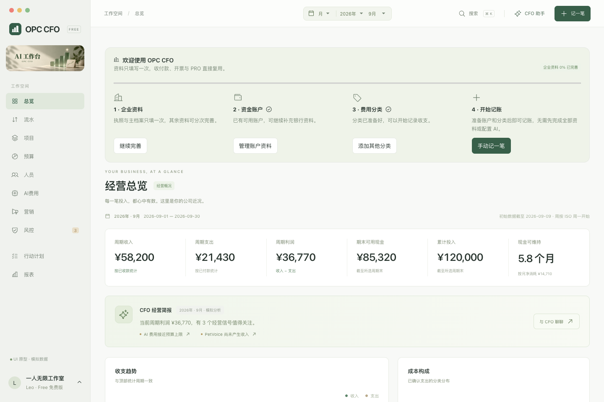

# OPC CFO

**一个人的公司，也有 CFO。**

OPC CFO 是面向独立创业者与一人公司的 macOS 财务工作台：记录收支、理解项目利润、管理成本，并用 AI 辅助经营分析。

[官网](https://shenmuli.com) · [下载与历史版本](https://github.com/shenmuli0324-glitch/opc-cfo-releases/releases)

> 本仓库仅用于产品介绍、公开发布元数据和安装包分发。不包含 OPC CFO 应用源代码。

## Free：日常经营

- 经营总览、收支流水、账户与项目、费用分摊、预算和风险。
- 人员、AI 服务和营销成本管理；应收应付与经营报表。
- CFO 助手、项目财务分析、AI 记账草稿与行动计划。
- 企业资料与本地 OCR：营业执照、发票、回单等文件先识别，再核对。
- 本机账本和备份；AI 不能未经确认直接改账。

## PRO：财税配套

计划价格 **¥199 / 年**。提供报税准备、财务结果、税务检查及申报资料整理。

目前可在示例公司验收本地功能；正式订阅、官网账号授权及扫码支付尚未开放。产品不直连税务申报系统，不代替专业申报服务。模型服务费用不包含在年费中。

## 安装与运行

- Apple Silicon Mac，macOS 14 及以上；Windows 开发中。
- 内置运行环境与 OCR 模型，无需额外安装 Node、Python 或下载 OCR 模型。
- 当前仅提供本地预览构建，尚未取得 Apple Developer ID 签名与公证；正式下载以 Releases 实际提供的附件为准。
- AI 功能需要配置可用模型；模型不可用时仍可手动记账。
- 应用启动时自动启动 AI 工作台；关闭应用窗口或退出应用时停止 Harness。行动计划仅在应用运行时执行。

## 数据与 AI

财务账本保存在本机。业务页面的文件识别走本地解析/OCR；只有会话中复杂文档理解才可能使用配置的多模态模型。使用 AI 时，相关上下文会发送给所选模型服务，可连接兼容的本地模型。

识别结果和 AI 建议必须经用户核对，才进入正式业务数据。截图均为示例数据。

## 版本与校验

安装包发布后，每个版本会提供更新日志、DMG、SHA256SUMS.txt 与 version.json。下载后可用 `shasum -a 256 安装包.dmg` 核对摘要。

发现版本问题时优先备份资料，再参考该 Release 的说明或历史版本。不要将同名版本中的不同安装包混用。

## 联系我们

深圳木立科技有限公司 · [shenmuli.com](https://shenmuli.com)

客服码用于咨询与反馈，不是付款码。

粤ICP备2026048420号-1
