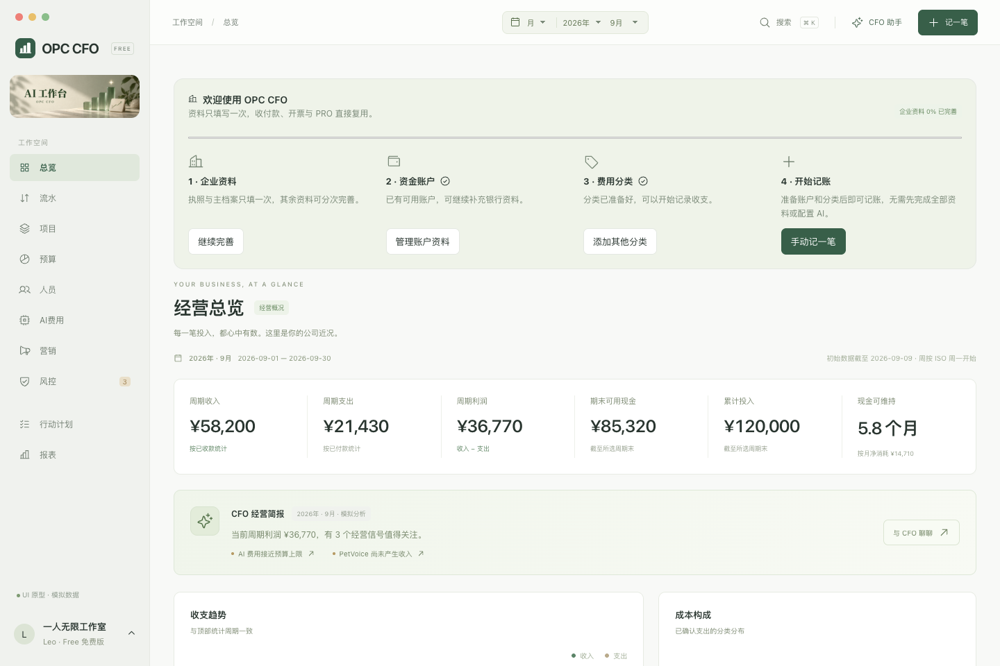

# OPC CFO

**一个人的公司，也有 CFO。**

OPC CFO 为独立创业者与一人公司提供本地财务工作台，把个人与公司往来、项目、预算、费用和经营分析放在同一条工作流程中。

[官网](https://shenmuli.com) · [下载安装包](https://github.com/shenmuli0324-glitch/opc-cfo-releases/releases/tag/v0.4.13) · [历史版本](https://github.com/shenmuli0324-glitch/opc-cfo-releases/releases) · [新版营销海报](https://github.com/shenmuli0324-glitch/opc-cfo-releases/releases/download/v0.4.13/OPC-CFO-0.4.13-poster.png)

> 本仓库仅保存产品说明、公开发布元数据及安装包，不包含 OPC CFO 源代码。

## 经营与财务

- 经营总览、资金账户、收支流水、项目和预算。
- 人员、AI 服务与营销费用；风险提示、行动计划及可导出的报表。
- 付款申请、审批、付款记录、发票、凭证和对账的关联流程。
- 个人与公司往来：工资、报销、个人代付、股东投入及股东借款。
- 营业执照、发票和回单的本地 OCR；识别结果经确认后入账。
- 本地 SQLite 账本及本地备份，账号数据与模型配置相互隔离。

## PRO 与 CFO-PRO

PRO 提供税务资料整理、员工档案与工资关联，以及已配置云服务的加密云备份。会员每月赠送的 AI 积分、产品价格和权益以应用购买页的实时配置为准。

CFO-PRO 是可选的官方财务模型服务，支持查看积分与购买用量套餐。也可配置自己的 DeepSeek 或 OpenAI 兼容模型。CFO 助手、AI 记账和 AI 工作台使用统一的模型配置。

软件辅助整理资料和分析经营，不直接替代国家平台的申报、缴费核验，也不把 AI 建议当作已确认账务。

## 安装与运行

- macOS：Apple Silicon，macOS 14 及以上。
- Windows：x64，安装时需要可用的 Microsoft Edge WebView2 Runtime；缺少时安装器将尝试联网安装。
- 安装包内置 Harness、Node 运行环境和 OCR，无需安装开发工具。
- 当前版本为预览测试版：macOS 使用 ad-hoc 签名，尚未进行 Developer ID 签名和公证；Windows 安装包尚未进行代码签名。
- 首次使用需要联网登录；后续使用遵循账号及订阅的离线授权期限。
- AI 工作台随应用启动，退出时结束 Harness。自动行动仅在应用运行时执行。

本次 Windows 预览包已通过财务核心、Harness、OCR、静默安装及实际欢迎页面启动检查。真实账号登录、付款和各用户的模型连接仍需在各自环境验收。

## 数据与 AI

财务账本保存在本机。开启云备份需确认公司归属，备份在本机加密后上传，不包含模型密钥、登录 Token 和 Harness 会话。

使用 AI 时，相关业务上下文会发送给所选模型服务。支持连接兼容的本地模型；AI 不可用时仍可手动记账。模型 API Key 保存在当前用户的本机配置文件，不使用 macOS 钥匙串。

## 版本与校验

每个 Release 提供更新日志、macOS DMG、Windows 安装包、`SHA256SUMS.txt` 和 `version.json`。官网直接链接 GitHub 下载页，服务器不转发安装包。

macOS 可用 `shasum -a 256 安装包.dmg`，Windows 可用 PowerShell `Get-FileHash 安装包.exe -Algorithm SHA256` 核对摘要。

升级前保存工作并备份公司数据。回退版本前确认数据库兼容性，不要让旧版本直接覆盖新版本的数据。

## 联系我们

深圳木立科技有限公司 · [shenmuli.com](https://shenmuli.com)

客服码用于咨询与反馈，不是付款码。截图为示例数据。

粤ICP备2026048420号-1
